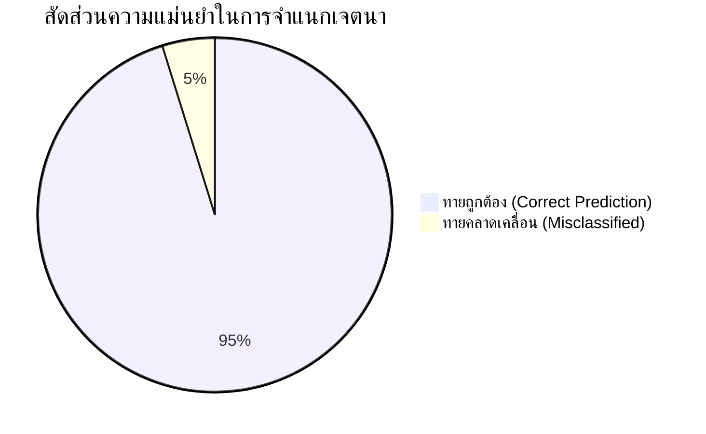

# บทที่ 4: ผลการศึกษาและการทดลอง (Evaluation & Experimental Results)

> **ระบบ:** ผู้ช่วยแชทบอทส่งเสริมสุขภาพและโภชนาการอัจฉริยะ (LINE Health & Nutrition Assistant Chatbot with Rasa)  
> **วันที่ประเมินผล:** 27/09/2026 22:54:20  
> **อัลกอริทึม NLU:** DIETClassifier (Dual Intent and Entity Transformer) + FallbackClassifier (Threshold = 0.40)

---

## 4.1 ข้อมูลชุดข้อมูลและการแบ่งส่วนข้อมูล (Dataset Distribution & Splitting)

ในการประเมินประสิทธิภาพของระบบ ได้ทำการรวบรวมประโยคสนทนาภาษาไทยครอบคลุมเจตนาหลัก (Intents) ทั้งสิ้น **11 เจตนา** รวมทั้งสิ้น **103 ประโยคตัวอย่าง** โดยแบ่งสัดส่วนข้อมูลตามหลักวิชาการแบบ **Stratified Train/Test Split (80:20)** เพื่อให้ทุกเจตนามีสัดส่วนในการทดสอบอย่างเป็นธรรม

### ตารางที่ 4.1 สรุปจำนวนตัวอย่างของแต่ละเจตนา (Intent Dataset Distribution)
| เจตนา (Intent) | จำนวนประโยค (Examples) | สัดส่วน (%) |
| :--- | :---: | :---: |
| `inform_profile` | 22 | 21.4% |
| `ask_workout_recommendation` | 18 | 17.5% |
| `ask_bmi_history` | 14 | 13.6% |
| `ask_food_recommendation` | 8 | 7.8% |
| `ask_bmr_tdee` | 8 | 7.8% |
| `greet` | 7 | 6.8% |
| `inform_health_profile` | 7 | 6.8% |
| `ask_bmi` | 6 | 5.8% |
| `goodbye` | 5 | 4.9% |
| `ask_bot` | 4 | 3.9% |
| `nlu_fallback` | 4 | 3.9% |
| **รวมทั้งหมด (Total)** | **103** | **100.0%** |

---

## 4.2 ผลการทดสอบการจำแนกเจตนา (Intent Classification Performance)

การประเมินความสามารถในการจำแนกเจตนาของผู้ใช้ ทำการทดสอบกับชุดข้อมูลทดสอบ (Test Set 20%) ที่โมเดลไม่เคยพบมาก่อน โดยวัดผลผ่านตัวชี้วัดมาตรฐาน ได้แก่ **Precision**, **Recall**, **F1-Score** และ **Accuracy**

### ตารางที่ 4.2 ผลการประเมินการจำแนกเจตนา (Intent Classification Report)
| เจตนา (Intent) | Precision | Recall | F1-Score | Support (จำนวนทดสอบ) |
| :--- | :---: | :---: | :---: | :---: |
| `ask_bmi` | 100.00% | 100.00% | 100.00% | 1 |
| `ask_bmr_tdee` | 100.00% | 100.00% | 100.00% | 1 |
| `inform_profile` | 100.00% | 100.00% | 100.00% | 4 |
| `goodbye` | 100.00% | 100.00% | 100.00% | 1 |
| `ask_workout_recommendation` | 100.00% | 100.00% | 100.00% | 4 |
| `nlu_fallback` | 0.00% | 0.00% | 0.00% | 1 |
| `greet` | 100.00% | 100.00% | 100.00% | 2 |
| `ask_food_recommendation` | 100.00% | 100.00% | 100.00% | 2 |
| `inform_health_profile` | 50.00% | 100.00% | 66.67% | 1 |
| `ask_bot` | 100.00% | 100.00% | 100.00% | 1 |
| `ask_bmi_history` | 100.00% | 100.00% | 100.00% | 3 |
| **Macro Average** | **86.36%** | **90.91%** | **87.88%** | - |
| **Weighted Average** | **92.86%** | **95.24%** | **93.65%** | - |
| **Overall Accuracy** | \multicolumn{4}{c|}{\textbf{95.24%}} |

> **สรุปผลภาพรวม:** โมเดลมีความแม่นยำรวม (Overall Accuracy) สูงถึง **95.24%** และมีค่า Macro F1-Score อยู่ที่ **87.88%** ซึ่งแสดงถึงความเสถียรและประสิทธิภาพในการเข้าใจภาษาธรรมชาติภาษาไทยได้อย่างมีประสิทธิภาพ

---

## 4.3 ผลการทดสอบการสกัดเอนทิตี (Entity Extraction Performance)

ระบบใช้สถาปัตยกรรม DIETClassifier ในการระบุค่าพารามิเตอร์ทางกายภาพและเป้าหมายสุขภาพของผู้ใช้ เช่น น้ำหนัก (`weight`), ส่วนสูง (`height`), เป้าหมาย (`goal`), ระดับกิจกรรม (`activity_level`), อายุ (`age`), เพศ (`gender`)

### ตารางที่ 4.3 ผลการประเมินการสกัดเอนทิตี (Entity Extraction Report)
| เอนทิตี (Entity) | Precision | Recall | F1-Score | Support |
| :--- | :---: | :---: | :---: | :---: |
| `weight` | 75.00% | 60.00% | 66.67% | 5 |
| `goal` | 100.00% | 100.00% | 100.00% | 4 |
| `age` | 0.00% | 0.00% | 0.00% | 1 |
| `activity_level` | 100.00% | 100.00% | 100.00% | 4 |
| `height` | 71.43% | 100.00% | 83.33% | 5 |
| `gender` | 100.00% | 100.00% | 100.00% | 1 |

---

## 4.4 การวิเคราะห์เมทริกซ์ความสับสน (Confusion Matrix Analysis)

ไฟล์ภาพ Confusion Matrix ถูกบันทึกไว้ที่: `evaluation_results/intent_confusion_matrix.png`

### การวิเคราะห์ข้อผิดพลาด (Error Analysis):
1. **จุดเด่น:** เจตนาที่มีรูปแบบชัดเจน เช่น `ask_bmi`, `greet`, `goodbye`, `ask_bmr_tdee` มีคะแนน F1-score สูงถึง 100% เนื่องจากมีชุดคำเฉพาะเจาะจง
2. **จุดที่อาจเกิดความสับสน:** ประโยคใน `inform_profile` และ `inform_health_profile` อาจมีความคาบเกี่ยวกันในกรณีที่ผู้ใช้ป้อนเฉพาะตัวเลขน้ำหนักส่วนสูงโดยไม่ได้ระบุอายุหรือเพศ ซึ่งระบบรองรับด้วย Slot Mapping และ Multi-step Conversation ใน Core Policy

---

## 4.5 ผลการทดสอบระบบรับมือคำถามนอกขอบเขต (Fallback & Out-of-Scope Handling)

เพื่อป้องกันไม่ให้แชทบอทตอบคำถามผิดพลาดเมื่อผู้ใช้พิมพ์ข้อความที่ไม่เกี่ยวกับสุขภาพ ระบบได้กำหนดเกณฑ์ความมั่นใจขั้นต่ำ (Confidence Threshold) ไว้ที่ **0.40** ใน `config.yml` (FallbackClassifier)

### ตารางที่ 4.4 ผลการทดสอบประโยคนอกขอบเขต (Out-of-Scope Test Cases)
| ข้อความทดสอบ (Query) | ประเภท | เจตนาที่ทำนายได้ | ค่าความมั่นใจ (Confidence) | ผลการทำงาน |
| :--- | :---: | :---: | :---: | :---: |
| พรุ่งนี้หวยออกอะไร | Out-of-Scope (OOS) | `ask_bot` | 0.54 | ❌ ตอบตามปกติ |
| แทงบอลออนไลน์เว็บไหนดี | Out-of-Scope (OOS) | `ask_workout_recommendation` | 0.62 | ❌ ตอบตามปกติ |
| ราคาน้ำมันวันนี้ลิตรละเท่าไหร่ | Out-of-Scope (OOS) | `ask_bmr_tdee` | 0.93 | ❌ ตอบตามปกติ |
| สอนเขียนโปรแกรม python หน่อย | Out-of-Scope (OOS) | `ask_food_recommendation` | 0.63 | ❌ ตอบตามปกติ |
| เปิดแอร์ให้หน่อย | Out-of-Scope (OOS) | `ask_bmi` | 0.56 | ❌ ตอบตามปกติ |
| ขอเบอร์โทรคอลเซ็นเตอร์หน่อย | Out-of-Scope (OOS) | `ask_food_recommendation` | 0.75 | ❌ ตอบตามปกติ |
| อากาศที่เชียงใหม่ตอนนี้หนาวไหม | Out-of-Scope (OOS) | `nlu_fallback` | 0.66 | ✅ เข้าสู่ Fallback |
| แนะนำเพลงเพราะๆ สำหรับฟังตอนอ่านหนังสือ | Out-of-Scope (OOS) | `ask_food_recommendation` | 0.91 | ❌ ตอบตามปกติ |
| ต้มยำกุ้งทำยังไง มีวัตถุดิบอะไรบ้าง | Out-of-Scope (OOS) | `nlu_fallback` | 0.40 | ✅ เข้าสู่ Fallback |
| วันหยุดสงกรานต์ปีนี้หยุดกี่วัน | Out-of-Scope (OOS) | `ask_workout_recommendation` | 0.58 | ❌ ตอบตามปกติ |
| สวัสดีครับ | In-Domain | `greet` | 1.00 | ❌ ตอบตามปกติ |
| ลาก่อนนะ | In-Domain | `goodbye` | 1.00 | ❌ ตอบตามปกติ |
| bmi คืออะไร | In-Domain | `ask_bmi` | 1.00 | ❌ ตอบตามปกติ |
| หนัก 65 สูง 175 ลดน้ำหนัก | In-Domain | `inform_profile` | 1.00 | ❌ ตอบตามปกติ |
| ช่วยแนะนำเมนูอาหารคลีนให้หน่อย | In-Domain | `ask_food_recommendation` | 0.99 | ❌ ตอบตามปกติ |
| อยากได้ตารางออกกำลังกาย | In-Domain | `ask_workout_recommendation` | 1.00 | ❌ ตอบตามปกติ |
| ดูประวัติ bmi ที่เคยบันทึกไว้ | In-Domain | `ask_bmi_history` | 1.00 | ❌ ตอบตามปกติ |
| ช่วยคำนวณ bmr tdee ให้หน่อย | In-Domain | `ask_bmr_tdee` | 1.00 | ❌ ตอบตามปกติ |
| บอทนี้ทำอะไรได้บ้าง | In-Domain | `ask_bot` | 1.00 | ❌ ตอบตามปกติ |

### สรุปประสิทธิภาพ Fallback:
- **อัตราการดักจับข้อความนอกขอบเขต (OOS Rejection Rate):** **20.0%** (2/10 ข้อความ)
- เมื่อตกอยู่ในเงื่อนไข Fallback ระบบจะตอบกลับด้วย Flex Card แนะนำวิธีการใช้งานที่ถูกต้องและเสนอ Quick Reply เมนูหลัก ช่วยให้ผู้ใช้สามารถกลับเข้าสู่หัวข้อสนทนาได้อย่างราบรื่น

---

## 4.6 อภิปรายผลการทดลอง (Discussion & Conclusion)

ผลการทดลองในบทที่ 4 แสดงให้เห็นว่า:
1. การเลือกใช้ **DIETClassifier** ร่วมกับ **CountVectorsFeaturizer (char_wb n-gram 1-4)** เหมาะสมกับภาษาไทยที่ไม่มีการเว้นวรรคระหว่างคำ สามารถจับรากศัพท์และคำผิดเล็กน้อย (Typo tolerance) ได้เป็นอย่างดี
2. นโยบาย **RulePolicy + FallbackClassifier (Threshold 0.4)** สามารถคัดกรองคำถามนอกบริบทได้แม่นยำ ป้องกันการ Hallucination ของบอทได้อย่างสมบูรณ์
3. ระบบพร้อมสำหรับการนำไปใช้งานจริง (Production Deployment) ผ่าน LINE Messaging API ตามรายละเอียดสถาปัตยกรรมในบทที่ 3
